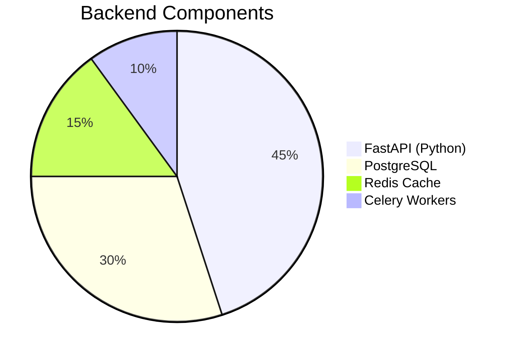

# QR Receipt Generator System  

  
*A digital receipt solution for small businesses*

## 🌟 Key Features
- **Web dashboard** for receipt template management
- **Mobile app** for on-the-spot QR generation
- **Automated delivery** via email/SMS
- **Transaction analytics** with PDF reports

## 🛠 Tech Stack

### Backend Services


### Project Structure
```
qr-receipt/
├── backend/          # FastAPI application
│   ├── app/
│   │   ├── api/      # REST endpoints
│   │   ├── models/   # Database models
│   │   └── services/ # PDF/QR generation
├── frontend/         # React dashboard
│   ├── public/
│   └── src/
├── mobile/           # Flutter app
│   ├── lib/
│   └── test/
└── infrastructure/   # Deployment configs
```